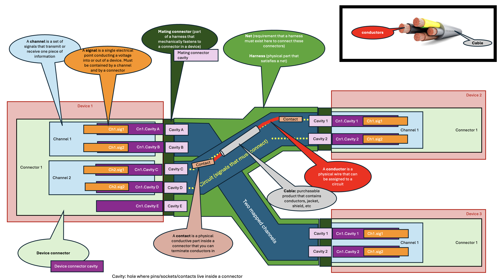

??? note "Mapping vocabulary"

    

    **Cable:**

    - A cable is a COTS or custom physical item, purchased by length, that contains electrical conductors, and are physically installed inside harnesses.

    **Conductor:**

    - A piece of copper, sometimes contained in a cable. Has as many properties, appearances, as you need

    **Circuit:**

    - A circuit is the entire electrical path between two signals of connected devices. You can assign conductors or other electrical elements along it. Instances assigned along the circuit have "circuit ids" which represent the order in which the circuit passes through them.

    **Channel:**

    - A channel is a set of signals that are related to each other (positive and negative of "power supply out 1", the channel)

    **Net:**

    - A Kicad/eCad term that represents a common node of electrical signals. Used in Harnice to represent a physical harness build, that bounds connectors into one set.

    **Signal:**

    - A signal is a single point of electrical interface between a device and the outside world. Signals are parts of channels and connectors.

