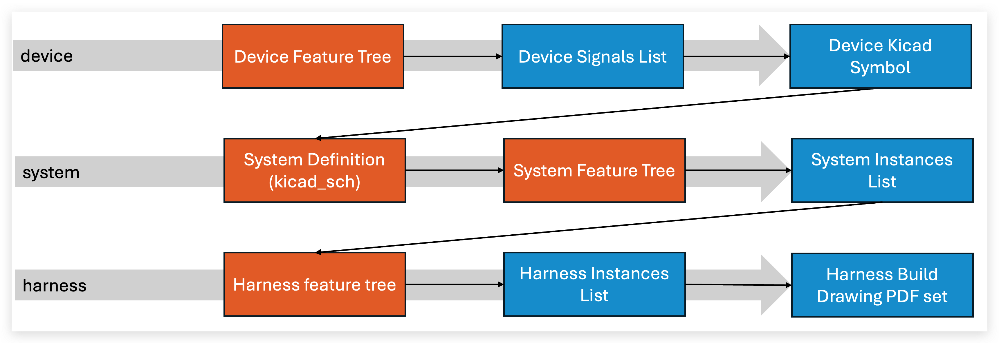

# Workflow Overview

Harnice supports different kinds of *products*, each of which have basic, distinct properties and store information in their respective ways. 

When you "run" Harnice, you're taking the input files of one product, and per a set of rules that you define, output files are generated. This process is called **render**. 

Some products have input and output files that are compatible with each other. Here's the basic workflow. 

*each gray bar is a `render` operation on a different product, orange is a user-defined set of render instructions, and blue is a file.*

# Feature Tree

Most products have something called a **feature tree**, which is inspired by 3D cad modeling. It's written directly in Python, and besides from some housekeeping that goes on in the background, is the bulk of what's happening when you `render` a product.

Inside the `feature tree` is where you can write your rules on how to build your product. Here's some ideas about how you can express your build intent in logical language:

 - If a harness mates with a device's ethernet socket, specifiy an RJ45 connector on that end of the harness.
 - If a harness contains signals that drive a safety-critical valve, clad that harness with red sleeving. 
 - If a system has more than 9 output devices connected to an input device that has 8 inputs, throw an error.
 - If a wire is conducting a thermocouple signal, use special cable and contacts.
 - Specify a label to be applied to a harness whose text is derived from the name of the harness's mating device. 
 - If part x is called out as a component of a harness, and part x always requires tool y set to z, add a buildnote with a leader to x that says y-z. 

 Here's the default feature tree that you get when you try to render a product for the first time. You'd add your logic in here somewhere.

 Keep an eye out for how the script references files for the product it's operating on, for other products, and how it generates outputs all in the same stroke as performing the derivation of the part. 





# Instances Lists

While having a concise set of rules is important to the definition of a product, it is not always sufficient as complete digital representation of the product. There's a difference between "as-intended" (feature tree) vs "as-designed". Harnice produces "as-designed" documentation for products in various formats depending on the product, but the following is a core Harnice design requirement:

**There shall always be**
==**one single source-of-truth representing the as-designed product,**== 
**from which  all outputs or dependencies are derived.**

Here are the "as-designed" filetypes of each designable product:

| Product | As-designed source of truth |
| ----------- | ------------------------------------ |
| systems, harnesses | `instances list` |
| device, disconnect | `signals list` |

*(the other products have more than one but I'm not sure how to defend why that's ok at time of writing)*

More information about these:

??? info "Instances Lists"
    

??? info "Signals Lists"
    

Here's a more detailed diagram of the Harnice workflow including the information covered so far. 

# File Formats

Harnice uses common file formats to store all of its data to improve portability and ease of interaction. Common formats in Harnice...
 - .csv (comma-separated value)
 - .tsv (tab-separated value; like csv but you can have commas in your data)
 - .py (plaintext file that contains Python syntax)

There are some standard file structures, called out by special names, that are used across many products. Regardless of the product type, the file should more or less do the same thing.

# Part Numbering

# File Structure

fileio.py contains functions that keep your files organized and easy to reference when they’re needed.

Products and macros are all supposed to have a function file_structure() that represents the file structure of the contents of that product on top of the current directory (rev folder).

Each value that contains a dict represents a directory, and each value that contains a string represents a file.

Keys are used for files to be more human readable.

You can add args as needed to describe more complicated structures.

When a product is rendered, that product’s file structure is automatically loaded into fileio.

You can reference files in that product by calling fileio.path(“file key”) from your script.
You can reference directories in that product by calling fileio.dirpath(“dirname”) from your script.

If you want to reference files that might not be defined in your product’s file structure (you’re running a bespoke macro with some weird content), you can temporarily pass a filepath dictionary into the function: fileio.path(“file key”, structure_dict={})

The same fileio functions can be called to regard different results depending on what structure_dict your current product, project, macro, etc has defined.

To “render” a product (harness, part, etc) with Harnice, the CLI will force you to operate in a “rev folder”
Revision data always stored in revision_history.tsv
Harnice will not render a revision if there’s data in the “status” field, i.e. “released” or “outdated”
Revision information can be referenced elsewhere, ex in pdf_generator
