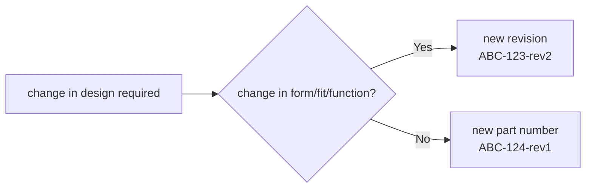

# :octicons-workflow-16: Workflow Overview

Harnice supports different kinds of *products*, each of which have basic, distinct properties and store information in their respective ways. 

When you "run" Harnice, you're taking the input files of one product, and per a set of rules that you define, output files are generated. This process is called **render**. 

Some products have input and output files that are compatible with each other. Here's the basic workflow. 

*each gray bar is a `render` operation on a different product, orange is a user-defined set of render instructions, and blue is a file.*

# :octicons-file-code-16: Feature Tree *(product as-intended)*

Most products have something called a **feature tree**, which is inspired by 3D cad modeling. It's written directly in Python, and besides from some housekeeping that goes on in the background, is the bulk of what's happening when you `render` a product.

Inside the `feature tree` is where you can write your rules on how to build your product. Here's some ideas about how you can express your build intent in logical language:

 - If a harness mates with a device's ethernet socket, specifiy an RJ45 connector on that end of the harness.
 - If a harness contains signals that drive a safety-critical valve, clad that harness with red sleeving. 
 - If a system has more than 9 output devices connected to an input device that has 8 inputs, throw an error.
 - If a wire is conducting a thermocouple signal, use special cable and contacts.
 - Specify a label to be applied to a harness whose text is derived from the name of the harness's mating device. 
 - If part x is called out as a component of a harness, and part x always requires tool y set to z, add a buildnote with a leader to x that says y-z. 

 Here's the default feature tree that you get when you try to render a product for the first time. You'd add your logic in here somewhere.

 Keep an eye out for how the script references files for the product it's operating on, for other products, and how it generates outputs all in the same stroke as performing the derivation of the part. 





# :octicons-table-16: Instances Lists, Signals Lists *(product as-designed)*

While having a concise set of rules is important to the definition of a product, it is not always sufficient as complete digital representation of the product. There's a difference between "as-intended" (feature tree) vs "as-designed". Harnice produces "as-designed" documentation for products in various formats depending on the product, but the following is a core Harnice design requirement:

**There shall always be**
==**one single source-of-truth representing the as-designed product,**== 
**from which  all outputs or dependencies are derived.**

Here are the "as-designed" filetypes of each designable product:

| Product | As-designed source of truth |
| ----------- | ------------------------------------ |
| systems, harnesses | `instances list` |
| device, disconnect | `signals list` |

*(the other products have more than one but I'm not sure how to defend why that's ok at time of writing)*

More information about these:

??? info "Instances Lists"
    

??? info "Signals Lists"
    

Here's a more detailed diagram of the Harnice workflow including the information covered so far. 

# :material-folder-sync-outline: Keeping Track of Everything

Harnice takes many inputs and produces many outputs. These are all stored as files on your computer. Harnice has built-in tools to help deal with all this. 

??? info "Harnice File Structures"
    

# :octicons-key-16: Part Numbering
Harnice is designed to work with git: every file format works well with `git diff`. However, even so, revisions of products are inevitable: if you release a part, start building it, then realize something needs to change, what do you do?

Change in [form, fit and function](https://en.wikipedia.org/wiki/Form,_fit_and_function) is a common way for engineers to draw the line between rolling a rev and rolling a part number. 

Harnice bakes revisions into part numbers, allowing you to spend your time worrying about engineering, not configuration management.

Before you render a product, the CLI will force you to operate in a “rev folder”. Revision history and statuses of a product is stored in a csv, and Harnice will not render a revision if the "status" column is not blank. That column is where you can record if a revision has been released, superseded, obsoleted, etc.

# Mapping Vocabulary


# The Workflow

