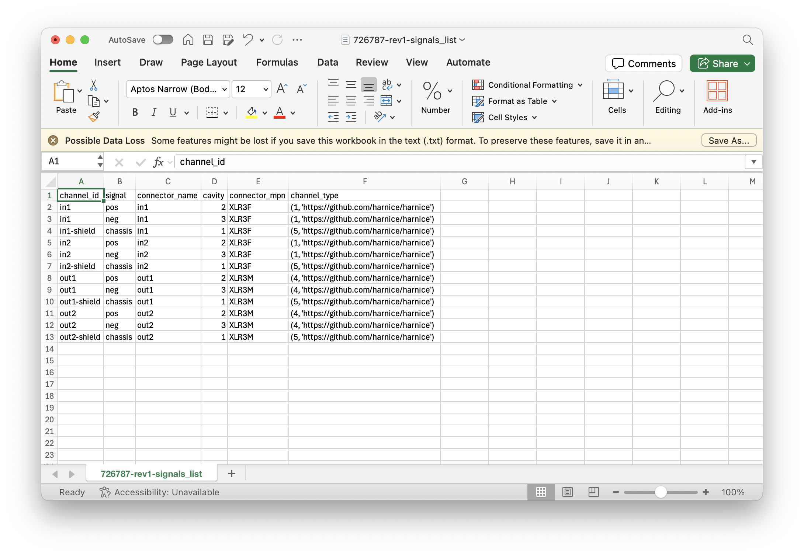
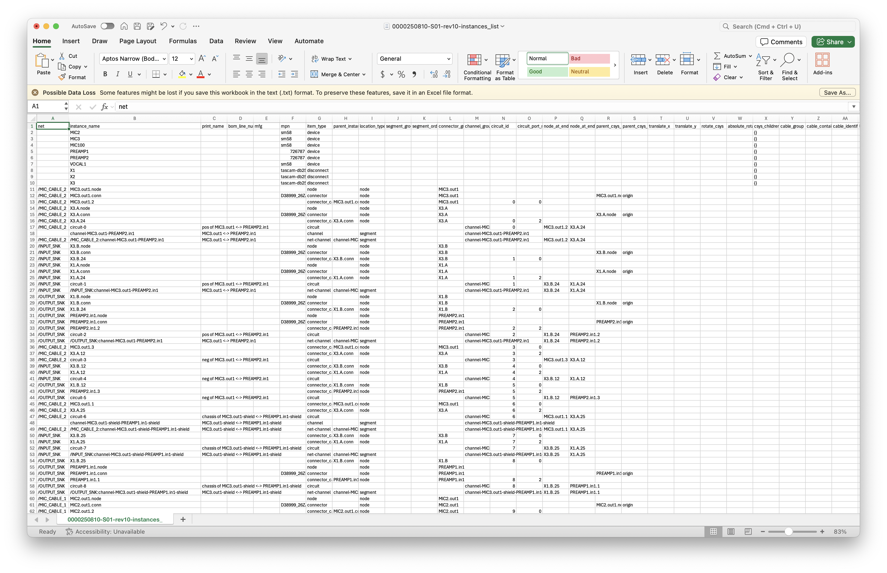

# Welcome to Harnice

**Harnice** is a Python-based, electrical system CAD package.

It designs harnesses **for you**... and does so much more... ***nicely***!

 --- 
## :octicons-rocket-16: Links
Download on pip: `pip install harnice`

Visit the repo: [`github.com/harnice/harnice`](https://github.com/harnice/harnice)

Submit bugs, feature requests: [`new issue`](https://github.com/harnice/Harnice/issues/new)

Send me an email: [`harnice.io@gmail.com`](mailto:harnice.io@gmail.com)

---
## :material-elevator-up: What's the elevator pitch?

Let's face it: designing harnessing sucks. Managing how your devices talk to each other in one software, and building stuff against that in another is terrible. Calculating voltage drops, naming stuff, keeping track of device interface configurations, software input lists, is almost always done manually, in error-prone, expensive, clunky, contradictory, time-wasting ways. 

==...*not anymore!!!*==

I developed Harnice because **fuck that.** I'm tired of the fact that the world is used to Kicad, Google Sheets, FreeCad, and so many other amazing free tools, but there's nothing for electrical systems. 

Harnice consolidates all high-level electrical design problems into one concise, consistent, infinitely configurable, reusable platform, where you can define what you need. Any imaginable output can be directly derived from the product of the compilation of your design rules. 

---

## :material-file-question-outline: How does it work?

Harnice was developed with one goal in mind: 

==***delete redundant sources of truth** in your electrical system definition.*==

As a system designer, your time is most valuably spent thinking about exactly what you want, not how to actually implement it. 

If your electrical system can be implemented by simple logic statements (if this then that), Harnice can help you record those design intents as rules, then compile them against libraries of devices and COTS items that you're trying to use, and give you ==**one fully compiled solution**== to your system.

---

## :fontawesome-regular-pen-to-square: What's the workflow?
1. Record how your devices work in a standardized, consolidated format.

1. Define which devices you want physically connected to which other devices.

1. Define your build rules, checks, part selections, channel mapping, naming conventions, color preferences, and more, in simple Python. 

1. Run `python3 harnice --r` in your command line to render all outputs. 

---

## :fontawesome-solid-warning: What do you get?
- Professional, complete, and beautiful multi-page PDF harness build drawings, derived from your system definition, and ready for manufacture

- System-wide graphic channel or wire map renderings

- Bills of materials derived from your system definition, including your cable lengths

- Full electrical system behavior simulation *(in work)*
- Complete reports on how to provision your involved devices for your use case *(in work)*

---

## :material-import: Can it do what I need?
Probably! But if not, Harnice supports **Macros**, which are Python files that can be configured to do anything. There's a macro start file written in docs, plus there's plenty of documentation on existing Harnice functions to get you started. 

---

## :octicons-x-circle-16: What doesn't Harnice do?
- Harnice is not intended to **make engineering decisions** for you. This is a platform for you to use your brain for the hard stuff, while the computers produce a determinite, predictable output of the rules you've defined. 

- Harnice is currenlty set up to link as-intended systems to as-designed. It does not yet have the ability to track as-built. 

- Harnice does not read your mind. If you are receiving results that you don't expect (unless it's a bug), you may need to rethink how you are communicating or organizing your thought process. **This is a feature!** Complete, explicit definition makes your designs easier to understand both human and machine alike. 

- Harnice doesn't have an easy way of definining parts yet. A barrier of entry to other software packages is that libraries do not come pre-defined. Harnice is no better. I see a future where you can upload a datasheet and AI can turn that into a logically parsible object that Harnice can parse at the stroke of a key, but we're not there yet. 

---

## :fontawesome-solid-sack-dollar: How much does it cost?
Free, fully free, forever and always. Fuck the establishment, money is a construct, and this is FOR YOU as much as it is for me. Build cool shit, don't waste your time designing harnesses ever again, and as always, feel free to contribute if you can. 

---
## :octicons-question-16: Who am I?
My name is Kenyon, I'm an electrical engineer by training and by day job. I have **no** background in programming. This is my first python project. Please forgive any beginner mistakes you might find. I'm always open to feedback, I love to learn, and I love to be outside!